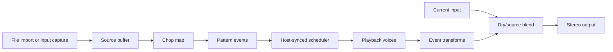

# Audio engine, effects, and routing

**Status:** Draft for review

## Signal flow

The audio input is used for explicit capture and optional dry blending. The finite source buffer is used for chop playback. Once a source is loaded, output is generated from the source according to the pattern. No hidden recording occurs.

## Plugin buses

- Main input: stereo, with mono support.
- Main output: stereo, with mono support.
- No sidechain bus or auxiliary outputs in the first release.
- Host bypass remains functional and should not destroy plugin state.
- No MIDI output in the first release; audio rendering and export are specified separately.

## Scheduler and playback

- Process host transport information at audio-block boundaries and schedule event start positions sample-accurately within the block.
- Handle play, stop, seek, loop points, tempo changes, and time-signature changes.
- On a seek or loop wrap, compute the correct pattern position without replaying stale events.
- For hosts without reliable musical time, fall back to sample-time progression with manual BPM.
- Use a bounded voice pool. When full, apply a documented voice-stealing rule: steal the quietest/oldest voice, with a short fade to avoid discontinuities.
- Playback voices interpolate source reads at the required rate and apply edge fades.
- Crossfade between adjacent events only when it does not obscure intended silence or retrigger articulation.

## Event transformations

First-release transforms:
- Reverse playback.
- Pitch shift by resampling over a bounded semitone range; preserve duration behavior explicitly in the UI.
- Retrigger with bounded subdivision and decay.
- Gate/trim with attack and release fades.
- Per-event level and pan.
- Optional low-pass/high-pass filter only if CPU and parameter count remain within agreed budget.

Do not describe basic resampling as time-stretching. Higher-quality time-stretching is a separate feature with quality, latency, and CPU tradeoffs and should not be included without a dedicated design review.

Transform order is fixed and visible in the spec: source region → reverse/read direction → playback-rate/pitch → gate/fades → filter if enabled → level/pan → voice sum. Any change to this order requires listening tests and state-version handling.

## Mix and output safety

- Dry/source mix is controlled separately from plugin bypass.
- Output gain has a clearly marked unity point.
- No automatic loudness normalization.
- A safety limiter is optional and disabled by default; if included, it must have a predictable ceiling and documented latency.
- Output must not produce NaN/Inf values for invalid parameters or extreme host inputs.
- Denormal handling is required for DSP paths where needed.

## Real-time and thread-safety rules

- No file reads, decoding, memory allocation, mutex waits, logging, or GUI calls in the audio callback.
- Source loading, decoding, and transient analysis occur on worker threads.
- Prepared source buffers and pattern snapshots are handed to the processor using a bounded, race-free mechanism.
- Deallocation of large old buffers occurs off the audio thread.
- Capture writes into preallocated storage and has explicit overflow behavior.
- Parameter reads use the framework’s real-time-safe mechanism.
- Host playhead data may be unavailable or invalid; all fields require validation.

## Latency and performance goals

- No algorithmic lookahead is required for chop playback, so target reported latency is zero unless a later quality mode introduces a measured delay.
- Realtime CPU and memory targets must be measured on a documented reference system during implementation. Establish thresholds before beta; do not make unmeasured performance claims.
- Avoid resampling a full source every block. Cache or prepare immutable source data for playback.

## Acceptance criteria

- Audio output is deterministic for fixed source, pattern, parameter automation, host time, and engine version.
- Playback remains continuous through host buffer sizes from 32 to 2048 frames at supported sample rates.
- No callback allocations, blocking, file I/O, or race conditions are found by instrumentation/review.
- Seek, loop wrap, stop/start, and tempo change tests do not leave stuck voices.
- Clicks are controlled at chop boundaries and when stealing voices.
- Mono and stereo paths produce valid, expected output.
## Module boundary and migration

The playback and DSP implementation belongs in `audio_renderer`, independent of plugin buses and UI. It accepts immutable source buffers and flattened scheduled events defined by `chop_contracts`, then writes to caller-provided output spans/buffers. The VST3 adapter owns host bus negotiation, transport-to-scheduler conversion, host bypass, and parameter automation. No JUCE or VST SDK type crosses the renderer's public API.

**Transfer guide:** copy `modules/audio_renderer/` and its declared contracts dependency; map the destination application's source and event types at one adapter boundary; configure sample rate and maximum block size; provide prepared immutable buffers; then run DSP, real-time-safety, and host timing tests. Do not copy plugin bus or editor code unless the target is also a JUCE VST3 plugin. See `modules/audio_renderer/MIGRATION.md`.
