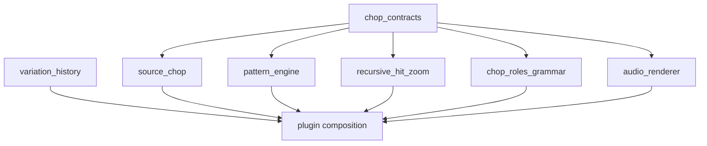

# Component portability protocol

**Status:** Required architecture for all ChopFractal components  
**Purpose:** Make project parts independently buildable, testable, understandable, and transferable to other projects with minimal changes.

## 1. What counts as a module

A module is a cohesive capability with an explicit public interface and one owner. It can be a behavior library, a format adapter, or a UI adapter. Every module must be possible to build or validate without building the whole plugin. Modules may share the small `chop_contracts` package; they must not import each other's private implementation.

A folder is not modular merely because it has its own directory. It needs a stable contract, declared dependencies, isolated tests, documented state, and a migration path.

## 2. Required package layout

```text
modules/<module_id>/
  include/<namespace>/<module_id>/
  src/
  tests/
  examples/                 # include when it reduces integration effort
  CMakeLists.txt
  module.json
  README.md
  MIGRATION.md
  LICENSE or NOTICE         # when required; retain project-level license notices
```

Keep each module's dependencies in `module.json`. If a file is needed to build the module, it belongs in the module or is an explicit dependency. Do not rely on root-level include paths, project globals, hidden generated files, or local machine configuration.

## 3. Public contract

Each module spec and implementation must define:

- Stable module ID, API version, and product state-schema version if it stores state.
- Public types, commands, return values, error cases, and ownership/lifetime rules.
- Threading contract: which calls are real-time safe, worker-thread only, or UI-thread only.
- Resource limits and behavior at the limit.
- Determinism guarantees, if output depends on a seed or input ordering.
- Required dependencies and the reason each is needed.
- Compatibility and deprecation rules.

Use portable standard C++17 for behavior modules unless a documented requirement makes that impractical. Keep JUCE, VST3 SDK, file dialogs, host playhead objects, and widget types inside adapters. Avoid global mutable state, hidden singletons, and callbacks into an owning application.

## 4. Dependency rules

The intended dependency graph is:



`variation_history` is generic and may have no dependency on ChopFractal domain types. Host and UI adapters connect through the composition root. No module may import the plugin editor or processor. No circular dependency is allowed. Adding a dependency requires a written reason, a version, and a portability check.

## 5. Module manifest

`module.json` records at minimum:
- `id`, `name`, `version`, `api_version`, `state_schema_version` if applicable.
- `language_standard`, `build_target`, `public_headers`.
- `dependencies` with module IDs and supported version ranges.
- `license`, `notices`, and third-party dependencies.
- `threading`, `platforms`, `deterministic`, and `real_time_safe` declarations.
- `migration_guide` path and standalone test command.

Use semantic versioning: patch for compatible fixes, minor for backward-compatible additions, and major for breaking API or state changes. A copied module retains its module ID, version, and notices until the receiving project intentionally forks it.

## 6. Required tests

Every module has tests that run without the plugin target. At minimum:
- Public-header consumer compile.
- Core behavior, boundary, invalid-input, and resource-limit tests.
- Determinism tests where relevant.
- State round-trip and migration tests where relevant.
- One minimal integration example or smoke test.
- A clean consumer-project test using only declared dependencies.

## 7. Transfer and migration guide

Every `MIGRATION.md` gives a copy-and-integrate recipe:

1. List exact module folders and minimum dependency versions.
2. Copy the module and required dependency packages; retain license/notice files.
3. Add the module's CMake target or documented source list.
4. Map receiving-project types at one adapter boundary; do not edit the module core to use host/UI types.
5. Describe state import/export and schema migration.
6. Show a minimal compile and usage example.
7. Give standalone tests and a smoke test command.
8. List known platform assumptions, optional adapters, and removal steps.

Where useful, provide a small transfer script that copies only the module and declared dependencies. Never copy build output, generated binaries, unrelated project code, or private credentials. Do not create a git submodule dependency for the initial release; keep copying or source-archive integration simple. If a module is reused repeatedly, consider extracting it to its own repository without changing its public ID or API.

## 8. Integration contract

The plugin composition root is the only place that wires modules together. It:
- Converts host timing to the common musical-time model.
- Supplies immutable source/chop snapshots to pattern modules.
- Injects optional mutation policies such as chop-role grammar.
- Flattens nested events before audio scheduling.
- Publishes complete immutable state snapshots to the processor.
- Routes module commands and view snapshots to the UI adapter.
- Composes state payloads by module ID and schema version.

Adapters translate; they do not duplicate algorithms. On a module upgrade, run module tests first, then adapter and full-plugin tests.

## 9. Reuse checklist

A module is transferable only when a clean project can build it with declared dependencies, its public contract is understandable without product internals, tests pass outside the plugin, state has a version, and the migration steps succeed. If it fails one of these checks, simplify the boundary before calling it modular.
