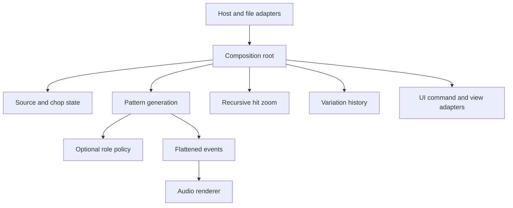

# Modular integration and transfer plan

**Status:** Required build and composition plan  
**Purpose:** Make feature implementation parallelizable, integration predictable, and later module transfer low effort.

## 1. Module map

| Module | Responsibility | Dependencies | Host/UI dependency |
|---|---|---|---|
| `chop_contracts` | Stable source, chop, time, and event data contracts | None | None |
| `source_chop` | Source metadata, markers, chop editing, analysis results | `chop_contracts` | None in core |
| `pattern_engine` | Pattern tree, deterministic generate/mutate, locks, flattening | `chop_contracts` | None |
| `recursive_hit_zoom` | Child patterns inside selected event bounds | `chop_contracts` | None |
| `chop_roles_grammar` | Role metadata, rule validation, candidate policy | `chop_contracts` | None |
| `variation_history` | Generic immutable branch graph for serialized snapshots | None | None |
| `audio_renderer` | Voice playback and event transforms | `chop_contracts` | None |
| `state_codec` | Versioned module payload container/migration helpers | None | None |
| `plugin_host_adapter` | VST3 buses, host timing, automation, lifecycle | JUCE/VST3 plus module contracts | Host-specific |
| `plugin_ui_adapter` | Source, pattern, hierarchy, roles, and history views | JUCE UI plus view/command contracts | UI-specific |
| Composition root | Wires commands, immutable snapshots, state, and audio | All required modules | Plugin target |

Feature modules do not depend on each other. The composition root injects role policy into generation, requests nested child patterns, stores snapshots, flattens patterns, and delivers events to audio rendering.

## 2. Public integration flow

All crossings use public value types or narrow interfaces. Do not pass mutable internal objects across module boundaries. Pattern mutations produce a complete validated snapshot before the audio processor receives it.

## 3. Delivery sequence

### Stage A: Contracts and scaffolding

1. Agree C++ standard, compiler matrix, license, and repository conventions.
2. Create `chop_contracts` with source IDs, chop bounds, musical time, flat events, error/result, and stable ID rules.
3. Create module manifest schema, CMake helper, standalone test template, and a clean consumer example.
4. Configure CI to build contracts and a minimal consumer without JUCE.

**Gate:** public headers compile in a clean project and dependency checks pass.

### Stage B: Independent base modules

Implement `source_chop`, `pattern_engine`, `variation_history`, and `audio_renderer` against published contracts. Each can be developed and tested without the VST3 shell.

**Gate:** all module tests and consumer examples pass; no module includes another module's private headers.

### Stage C: Three requested feature modules

Implement Recursive Hit Zoom, Chop Roles and Grammar, and Variation Family Tree as separate packages. Variation history can be built during Stage B because it has no domain dependency. Each feature must pass its own migration smoke test before integration.

**Gate:** deterministic behavior, state versioning, limits, and module transfer instructions are verified.

### Stage D: Composition and adapters

1. Build the composition root with command routing and immutable snapshot handoff.
2. Connect source/chop state to pattern generation.
3. Inject role grammar as an optional candidate policy.
4. Attach nested children and flatten events before audio rendering.
5. Store Generate/Mutate results as history nodes and restore branches through the serializer.
6. Add JUCE/VST3 host timing and parameter adapter.
7. Add UI adapters for source, pattern, recursive zoom, role rules, and history tree.

**Gate:** end-to-end smoke test covers load → chop → generate → mutate/zoom → branch → save/reload → playback.

### Stage E: Portability and release

Run clean-copy tests for all modules, full host tests, audio-thread safety checks, platform builds, and release packaging. Update each module manifest and migration guide when APIs change.

**Gate:** module tests, integration tests, project recall, VST3 validation, host matrix, and performance gates all pass.

## 4. Transfer workflow

For a module used by another product:

1. Select the module and recursively include only dependencies named in its manifest.
2. Copy source, public headers, tests, examples, manifest, README, migration guide, and required notices.
3. Add each module target to the receiving build in dependency order.
4. Implement a small adapter between receiving types and module contracts.
5. Keep host, UI, and file-format adapters in the receiving project.
6. Run the module's standalone tests and the receiving project's consumer smoke test.
7. Validate saved-state schema compatibility before moving existing project data.
8. Record the imported module version and any local patches; upstream fixes should be cherry-picked or manually reconciled, not copied over silently.

Prefer a clean adapter over changing the portable module for one project's naming conventions. For a one-time experiment, a source archive or copied folder is sufficient. Extract to a separate repository only after a module has proven reuse value.

## 5. Integration rules

- Integrate through public headers and CMake targets only.
- No circular imports or duplicated domain types.
- Stable IDs belong to their owning module; UI element IDs are not serialized as domain IDs.
- Feature modules must expose validation and error results; the composition root decides user messaging.
- Audio callback receives prepared immutable data; snapshots, analysis, file I/O, and history writes stay off-thread.
- Module state is stored under module ID and schema version.
- Adapters translate; they must not fork the module algorithm.
- Every API or state change updates the module manifest, tests, docs, and migration guide in the same change.

## 6. Additional project requirements

Before coding, confirm:
- Root and per-module license policy, third-party license compatibility, and attribution transfer.
- Supported platforms/compiler matrix and minimum C++ standard.
- How module builds and plugin builds are separated in CI.
- Parameter ID ownership and append-only rules for host automation.
- State migration policy and maximum serialized source size.
- Error reporting and logging boundary; core modules return errors but do not present UI.
- Threading and ownership for buffers crossing the audio/UI boundary.
- Reproducible build, signing, installer, and release artifact ownership.
- API review checklist and deprecation policy.

These items are part of modularity because missing build, license, state, or thread rules can make a seemingly reusable component costly or unsafe to transfer.
